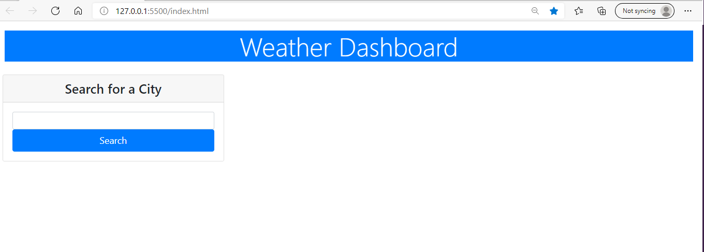

# Weather-dashboard

## Description
The project was made in order to build a weather dashboard making it easier for a user to see the current weather and the forecast for upcoming 5 days. The advantage of the following Weather-dashboard is that allows the user to look for every city in the US.

## Project status
This project is in its testing phase. 

## Installation
 * Create a repo on GitHub
 * Clone the repo on the computer
 * Create an HTML, CSS and Javascript file
 * Write the HTML and CSS code
 * Get the API key out of openweather.org 
 * Write the apiUrl in the Javascript file
 * Write the Javascript functions that would run the API
 * Use google DevTools in order to inspect if the code is running correctly
 * Pull and commit changes on Github
 * Publish the website on Github pages

## Finished Project

## Link to the website
https://sofiacrf.github.io/Weather-dashboard/